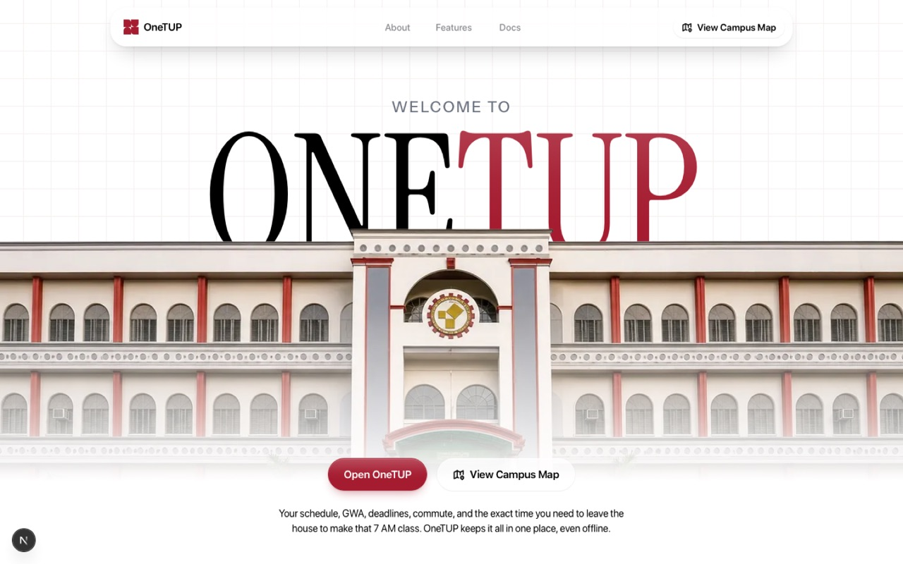
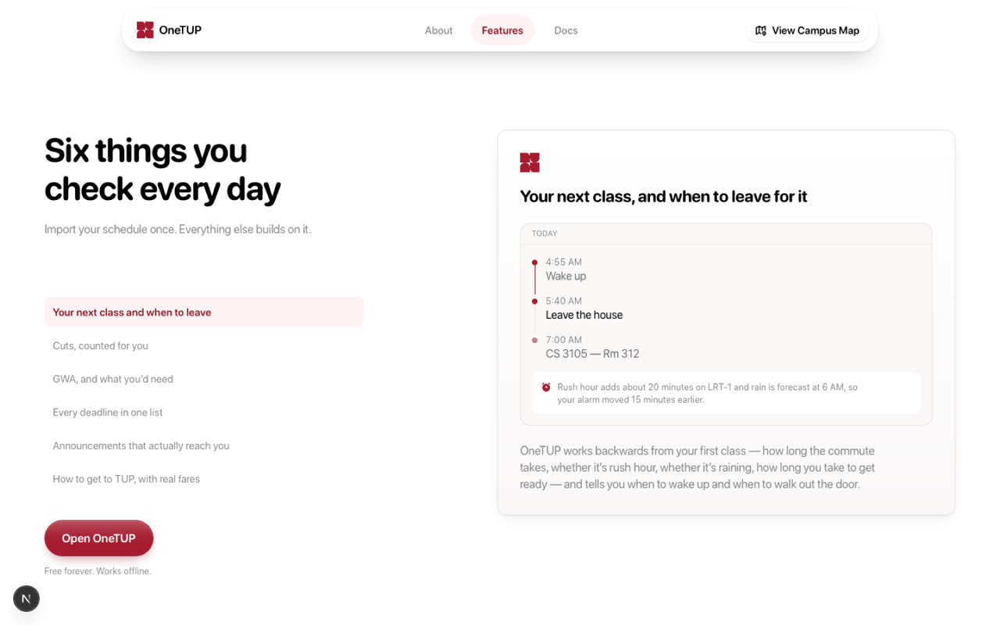
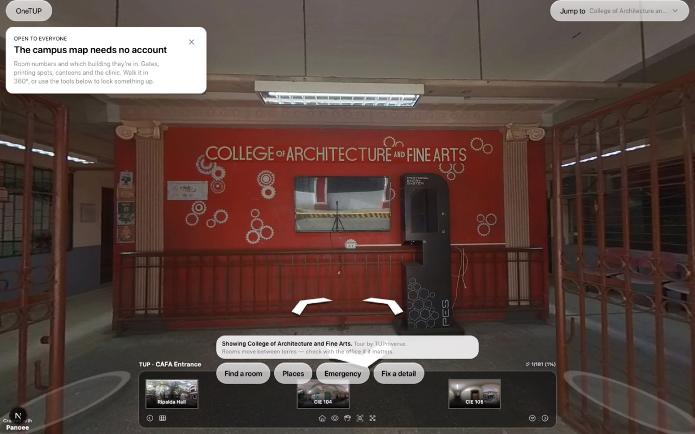
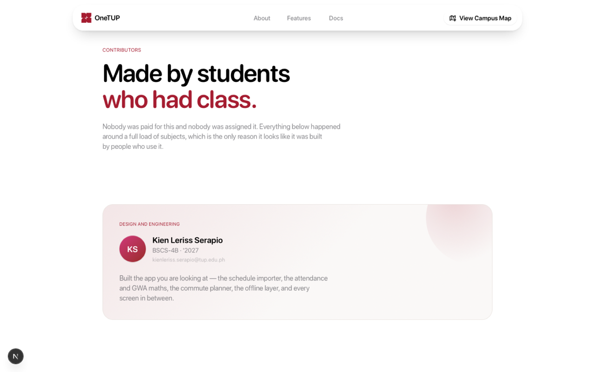
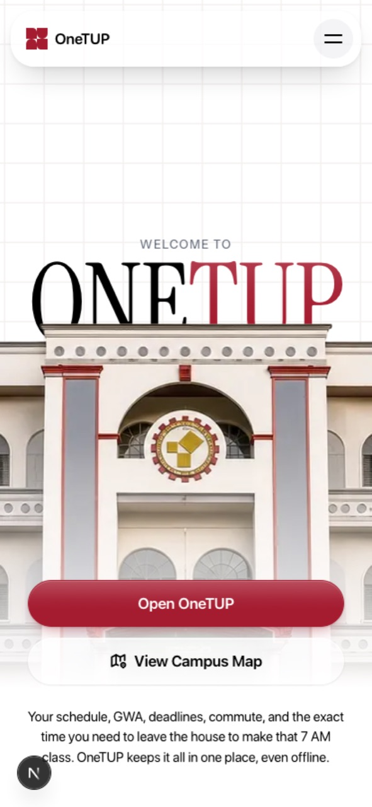
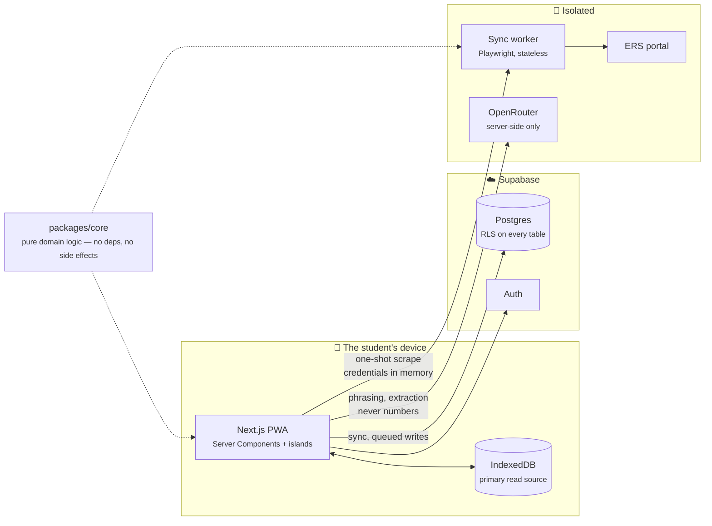

<div align="center">



# OneTUP

**Everything about your classes, in one app.**

Your schedule, your cuts, your GWA, your deadlines, and the exact time you need
to leave the house to make that 7 AM class. Built by TUP Manila students, for
TUP Manila students. Free forever, and it works when campus wifi doesn't.

[](https://github.com/kienserapio/OneTUP/actions/workflows/ci.yml)
[](LICENSE)
[](CONTRIBUTING.md)
[](https://github.com/kienserapio/OneTUP/labels/good%20first%20issue)

[](https://nextjs.org)
[](https://www.typescriptlang.org)
[](https://supabase.com)
[](https://web.dev/progressive-web-apps/)
[](#testing)

[**What it is**](#what-onetup-is) ·
[**Screens**](#what-it-looks-like) ·
[**Quickstart**](#quickstart) ·
[**Architecture**](#architecture) ·
[**Docs**](#documentation) ·
[**Contributing**](#contributing)

</div>

---

## What OneTUP is

Every TUP student already has a system. It is six group chats, a Notes app, a
screenshot of a schedule, and a running count of cuts kept in their head.

OneTUP replaces that with one app that answers a single question when you open
it: **what do I need to know today?**

Import your schedule once — paste it, no credentials needed — and everything
else builds on top of it. The app knows your next class and the room. It knows
how many times you can still miss it. It knows your GWA and what you would need
next term to move it. It knows when to wake you up, because it knows how long
LRT-1 takes at 6 AM in the rain.

> **It is a student project, not an official TUP service.** Nothing here is
> endorsed by the university. It is free, the source is open, and the only
> reason it fits a student's day is that it was written by people living one.

### Three promises the code actually keeps

|  | Promise | How it is enforced |
| --- | --- | --- |
| 🔒 | **Your ERS password is never stored** | It exists in memory for one scrape and nowhere else. A schema check in CI fails the build if a column that could hold one is ever added. |
| 👤 | **Your grades and cuts are yours alone** | Row Level Security is the authorisation model. There is no admin override, no faculty view, and no query path that returns another student's data. |
| 📶 | **It works with no signal** | IndexedDB is the primary read source; the network is the sync target. Writes queue and reconcile when you are back. |

---

## What it does

| Module | What you get |
| --- | --- |
| 📅 **Schedule** | Paste it or import it from ERS. It is the spine — everything else reads from it. |
| ✅ **Attendance** | One tap to log a class. Cuts counted against the real limit, with the number you have left. |
| 📊 **Grades & GWA** | Your weighted average, term by term, plus a what-if planner for the grade you need. |
| 🗓️ **Deadlines** | Every requirement in one list, sorted by what is actually next. |
| 📣 **Announcements** | Share a screenshot or a wall of text into it; it comes back as a dated, structured item. |
| 🚌 **Commute** | Real routes and real fares, working backwards to when you should wake up and walk out. |
| 👥 **Classroom** | One shared tracker for your block section. Anyone can post; it lands in everyone's deadlines. |
| 🗺️ **Campus** | Room codes, buildings, gates, printing spots, the clinic — and a 360° walkthrough. No account needed. |
| 🤖 **Assistant** | Phrases and explains. It never invents a number — see the constraint below. |

---

## What it looks like

<table>
  <tr>
    <td width="50%"></td>
    <td width="50%"></td>
  </tr>
  <tr>
    <td align="center"><em>The landing page, on desktop</em></td>
    <td align="center"><em>The campus map — open to everyone, no account</em></td>
  </tr>
  <tr>
    <td width="50%"></td>
    <td width="50%" align="center"></td>
  </tr>
  <tr>
    <td align="center"><em>Contributors — your name goes here</em></td>
    <td align="center"><em>Installable to the home screen</em></td>
  </tr>
</table>

---

## Quickstart

### Prerequisites

| Tool | Version | Check |
| --- | --- | --- |
| Node.js | 22+ | `node --version` |
| pnpm | 11+ | `corepack enable && corepack prepare pnpm@11 --activate` |
| Docker | optional | Only for `pnpm db:types` |
| A Supabase project | optional | Only if you touch data |

### Get it running

```sh
git clone https://github.com/kienserapio/OneTUP.git
cd OneTUP
pnpm install
cp .env.example .env      # fill in Supabase and OpenRouter
pnpm db:push              # applies every migration in order
pnpm db:check             # RLS coverage, policies, view safety
pnpm dev
```

That starts the web app on <http://localhost:3000> — or the next free port,
which Next prints on startup. Every value in `.env` is documented inline.

Day to day, once the repo is set up, this is the whole thing:

```sh
pnpm dev
```

It derives `apps/web/.env.local` and `apps/worker/.env` from the root `.env` on
every run. **Never edit those two by hand** — they are overwritten.

### Get real data on screen

1. Open the app and create an account at `/sign-up`.
2. Go to **Schedule → Import → Paste** and paste your schedule.

The paste importer needs no credentials and no worker, which makes it the
fastest path from clone to something that looks like your week.

The sync worker is separate, and only needed to import from ERS directly:

```sh
pnpm worker:dev           # a second terminal, port 8787
```

<details>
<summary><strong>Signing up asks for an email confirmation</strong></summary>

Until the Supabase project has SMTP configured, confirm the address from the
Supabase dashboard under **Authentication → Users**, or create the account
there with *Auto Confirm*.

</details>

<details>
<summary><strong>Database connection is slow or times out</strong></summary>

Supabase's direct host (`db.<ref>.supabase.co`) is IPv6-only. Most machines and
CI runners have no IPv6 route, so `scripts/db.mjs` connects through the IPv4
session pooler and probes for the right region. Pin it in `.env` if the probe
is slow:

```
SUPABASE_POOLER_HOST=aws-0-ap-southeast-1.pooler.supabase.com
```

</details>

---

## Commands

| Command | What it does |
| --- | --- |
| `pnpm dev` | Runs the web app |
| `pnpm build` | Production build |
| `pnpm test` | Unit tests; the RLS suite skips itself without credentials |
| `pnpm test:watch` | The same suite, while you work |
| `pnpm typecheck` | Every workspace |
| `pnpm lint` | Every workspace |
| `pnpm worker:dev` | The ERS sync worker, on port 8787 |
| `pnpm db:push` | Applies pending migrations, each in one transaction |
| `pnpm db:status` | Applied vs pending |
| `pnpm db:check` | The schema safeguards from the data model doc §17 |
| `pnpm db:types` | Regenerates `packages/core/src/database.types.ts` (needs Docker) |
| `pnpm db:psql` | An interactive shell against the project |

---

## Architecture



### The stack

| Layer | Choice | Why |
| --- | --- | --- |
| App | **Next.js 16**, App Router, Server Components | A page that renders on the server is a page that works on a bad connection |
| Language | **TypeScript**, strict | |
| Data | **Supabase** — Postgres, Auth, RLS | Authorisation lives in the database, not in application code |
| Offline | **IndexedDB** via `idb` + a service worker | Reads never wait on a network that is not there |
| State | **TanStack Query** + **Zustand** | Server cache and UI state, kept separate |
| Maps | **Leaflet** | Routes and fares on a real map, no proprietary SDK |
| Motion | **Motion** (springs) | A CSS transition cannot be grabbed and reversed mid-flight |
| AI | **OpenRouter**, free-tier model ladders | Model choice is an environment edit, never a code change |
| Scraping | **Playwright** in a container | Stateless, credential-free, one job at a time |

### Repository layout

```
apps/web          Next.js 16 App Router PWA — the product
  src/app         Routes. (app) is the authenticated shell, the rest is public
  src/components  Feature components, grouped by module
  src/design      Tokens, type scale, materials, motion — the design system
  src/lib         Queries, offline layer, AI provider, import pipeline
apps/worker       Playwright container that reads a schedule from ERS, once
packages/core     Pure domain logic: parsers, GWA, attendance, fares, departure
packages/shared   Types and helpers shared across apps
supabase/         Migrations (RLS in the same file as every table) and RLS tests
scripts/          Migration runner, schema safeguards, env derivation
docs/             The full specification — start at docs/00-INDEX.md
```

`packages/core` has **no dependencies and no side effects**. Every number a
student acts on is computed there and tested there, which is what makes ADR-007
— *models interpret, they do not compute* — a checkable claim rather than a
promise.

---

## The constraints worth knowing before you change anything

These are not style preferences. Each one is load-bearing, and the reasoning is
in the docs. A pull request that breaks one will be turned down no matter how
good the rest of it is.

**ERS credentials are never persisted server-side.** No migration may add a
column that could hold one — `pnpm db:check` fails the build if one appears. The
worker holds no database credentials and writes nothing to disk. See
[07-AUTH-ERS.md](docs/07-AUTH-ERS.md).

**RLS is the authorisation model.** Not application code. Every user-owned table
has policies written in the same migration that creates it, every view carries
`security_invoker = true`, and there is no administrative override for a
student's grades or attendance. See [04-DATA-MODEL.md §17](docs/04-DATA-MODEL.md).

**Numbers are computed, never generated.** A model may phrase a GWA and may
interpret an unstructured announcement. It may not produce a grade, a cut count,
a fare or a date. See [ADR-007](docs/02-ARD.md).

**Attendance and grades are visible only to the owning student.** No aggregates,
no comparisons, no faculty visibility — not as a setting, but as an absence of
any query path that could return them.

**Offline is a first-class state.** IndexedDB is the primary read source;
Supabase is the sync target. Writes queue and reconcile. A student in a corridor
with no signal still sees their next class.

**The paste importer must never be removed.** It is the floor beneath ERS
import: no credentials, no portal dependency, always available.

---

## Working with the database

Migrations live in `supabase/migrations/`, numbered and applied in order. They
are **append-only** — never edit a migration that has been pushed; write a new
one.

Every new table needs, in the same migration file:

1. The table.
2. `alter table … enable row level security;`
3. Policies for every operation the app performs.
4. An index for every column the app filters on.

`pnpm db:check` fails if a table has RLS but no policy, a view is missing
`security_invoker`, or a column name looks like a credential store. That check
is a build gate, not a linter.

---

## Design system

`apps/web/src/design/` holds the tokens, type scale, materials and motion
primitives. Nothing outside it should hardcode a colour, radius, shadow, font
size or duration.

**Light only, and white.** There is no dark theme and no `prefers-color-scheme`
rule anywhere; `color-scheme: light` keeps a device set to dark from darkening
form controls anyway. Every surface is `#FFFFFF`, which removes the tonal step a
grouped background normally uses to separate a card from the page — so cards
carry a hairline border instead. A shadow alone is not separation on white, and
it disappears entirely in high-contrast mode.

**One saturated colour.** TUP crimson `#A51C30`, used for the active
destination, the primary action, and the assistant. It measures about 7.4:1 on
white, so it is safe as a foreground and not only as a fill. Status uses the
Apple system palette — green, yellow, orange, red — because those already mean
those things on a student's phone.

**One typeface, numbers included.** SF Pro is referenced through
`-apple-system` and `local()` rather than shipped: Apple licenses it for
interfaces on Apple platforms, not as a self-hosted webfont. Apple devices get
the real thing; everything else falls back to Inter, which is metric-compatible
enough that the layout does not shift. Data that is scanned — times, rooms,
course codes, fares, grades — uses tabular figures rather than a monospace face,
so columns still align without a second typeface in the interface.

**Motion uses springs, not CSS transitions**, for anything a finger touches: a
transition cannot be grabbed and reversed mid-flight. `transition()` in
`design/motion.ts` resolves a spring against the student's reduced-motion
preference, and the animated grid behind the landing hero does not render at all
when that preference is set.

### The shell

A 244px sidebar above 900px, a floating bar below — the same navigation rendered
two ways rather than two navigations. Both read from `components/app/nav-items`,
so they cannot disagree about what exists or what is selected. Below the
breakpoint only five destinations reach the bar; everything else is one tap
deeper from Today, because a bar with nine destinations is a menu.

---

## Testing

```sh
pnpm test          # 435 tests, ~30s
pnpm test:watch
```

- **`packages/core` is the tested layer.** Pure functions, no mocks needed. Any
  new calculation ships with tests for the boundary cases — the 1.00, the
  zero-unit subject, the term with a dropped course.
- **The RLS suite** in `supabase/tests/` skips itself without credentials, so
  the suite stays green on a fresh clone.
- **Never commit a real student's data** — name, ID number, grades — as a
  fixture. Anonymise it first.

CI runs `typecheck`, `test`, `build`, and the schema safeguards on every push
and pull request.

---

## Deploying

**Web app** — Vercel. Set the same variables `pnpm run env:sync` derives into
`apps/web/.env.local`. `NEXT_PUBLIC_*` reach the browser; nothing else may.

**Worker** — any container host:

```sh
docker build -f apps/worker/Dockerfile -t onetup-worker .
```

It needs `WORKER_SECRET` and nothing else. Rotate that secret quarterly.

**Notification dispatch** — `POST /api/notifications/dispatch` with
`Authorization: Bearer $WORKER_SECRET`, on a schedule of a minute or two. This
is what actually fires a wake alarm, because nobody is signed in at 4:55 AM.

---

## Documentation

The full specification lives in [`docs/`](docs/00-INDEX.md) and is the reason
this project can be picked up by someone who did not write it.

| # | Document | What it covers |
| --- | --- | --- |
| 01 | [Product Requirements](docs/01-PRD.md) | Problem, users, scope, success criteria |
| 02 | [Architecture & ADRs](docs/02-ARD.md) | System architecture, 14 decisions with rationale |
| 03 | [Technical Design — App](docs/03-TDD-APP-MODULE.md) | Module design, state, algorithms |
| 04 | [Data Model & Schema](docs/04-DATA-MODEL.md) | Postgres schema, RLS policies, migrations |
| 05 | [API Specification](docs/05-API-SPEC.md) | Internal API and the public TUP Data API |
| 06 | [AI Specification](docs/06-AI-SPEC.md) | Model routing, prompts, guardrails |
| 07 | [Auth & ERS](docs/07-AUTH-ERS.md) | Sign-up, credential handling, the scraper |
| 08 | [Landing Content](docs/08-LANDING-CONTENT.md) | Copy, no design |
| 09 | [Implementation Plan & QA](docs/09-IMPLEMENTATION-PLAN.md) | Phases, testing, release, ops |
| 10 | [Future Enhancements](docs/10-FUTURE-ENHANCEMENTS.md) | Roadmap and the data-API strategy |
| 11 | [Build Handover](docs/11-HANDOVER.md) | What was built, what bites, what is pending |
| 12 | [Classrooms](docs/12-CLASSROOMS-PLAN.md) | Block-section classrooms and the shared tracker — built |
| 13 | [Commute Routing](docs/13-COMMUTE-ROUTING-PLAN.md) | Real paths on the map, and where route and fare data comes from — planned |
| 14 | [Assistant](docs/14-ASSISTANT-PLAN.md) | A second provider, memory, and commute answers worth asking for — planned |
| 15 | [Class Suspensions](docs/15-SUSPENSIONS-PLAN.md) | *Walang pasok* as an advisory, never an automatic cancellation — planned |

**Reading order** — building it: 01 → 02 → 04 → 03 → 07 → 06 → 05 → 09 ·
evaluating it: 01 → 02 → 10 · designing it: 01 → 08 → 03 ·
auditing it: 07 → 04 → 02

---

## Contributing

**You do not need permission, and you do not need to be good at this yet.**
Everyone here learned in public.

1. Find something that annoys you — a wrong room code, a route that takes the
   long way, a button that lies about what it does.
2. [Open an issue](https://github.com/kienserapio/OneTUP/issues/new/choose)
   before you open a pull request.
3. Fork it, branch it, break it locally. Nothing you do locally affects anyone.
4. Send the pull request. Small and finished beats large and nearly.

Your name lands on the contributors page when it merges.

📖 **[CONTRIBUTING.md](CONTRIBUTING.md)** — setup, standards, commit convention,
and the full checklist
🤝 **[CODE_OF_CONDUCT.md](CODE_OF_CONDUCT.md)** — be decent, assume good faith
🔐 **[SECURITY.md](SECURITY.md)** — found a vulnerability? Report it privately,
never in an issue
🌱 **[Good first issues](https://github.com/kienserapio/OneTUP/labels/good%20first%20issue)**
— scoped to finish in an evening

You do not have to write TypeScript to help. Correct campus data, clearer copy,
Filipino strings, accessibility problems, and documentation that unconfuses the
next person are all real contributions.

---

## Status

V1 modules — schedule, attendance, grades, deadlines, announcements, commute —
are implemented, and so are block-section classrooms with their shared tracker
(`docs/12`). Faculty evaluation (M8) and study packs (M9) are specified in the
docs and not yet built; `docs/13`–`15` are planned and not started. See
[09-IMPLEMENTATION-PLAN.md](docs/09-IMPLEMENTATION-PLAN.md) for the sequencing
and the exit criteria each phase has to meet.

---

## Credits

Built by **Kien Leriss Serapio** (BSCS-4B), around a full load of subjects.

Standing on two student projects OneTUP would not exist without:

- **TUPniverse** — the 360° virtual campus tour: Lowel-Jay Rubino, Alltessa Jane
  Rosimo, Samantha Egar, Nicole Dela Cruz
- **ERS Schedule** — the groundwork on reading a schedule out of ERS: Dan
  Jheniel Bringas

---

## License

[MIT](LICENSE) — use it, fork it, ship it, learn from it.

OneTUP is an independent student project. It is not affiliated with, endorsed
by, or an official service of the Technological University of the Philippines.
[NOTICE.md](NOTICE.md) covers what the licence does not: the university's
marks, the campus photography, and the fonts.
